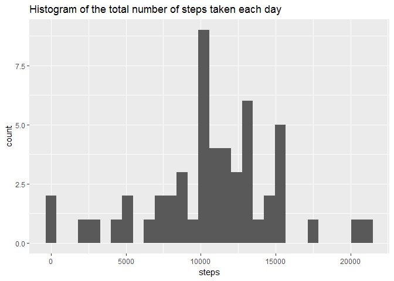
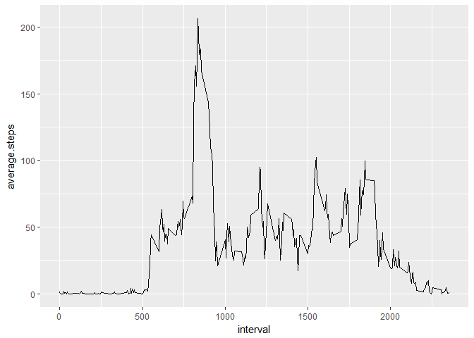
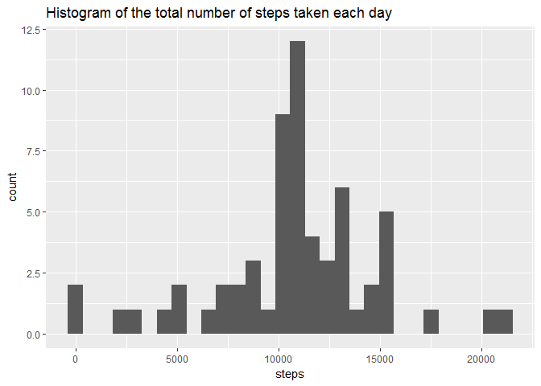
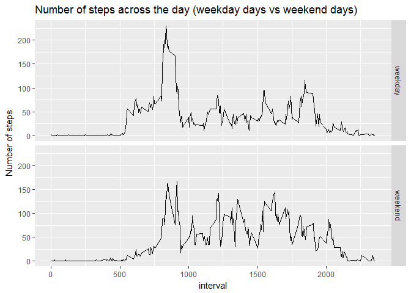

# Reproducible Research - Assignment - Week 2
AG  
9 September 2017  


## Load the required libraries


```r
library(tidyr)
library(dplyr)
library(ggplot2)
library(readr)
```


## Downloading and preprocessing the data


```r
download.file(url = "https://d396qusza40orc.cloudfront.net/repdata%2Fdata%2Factivity.zip",
              destfile = "repdata.zip")
df <- read_csv("repdata.zip", col_names = TRUE)
```

## What is mean total number of steps taken per day


```r
df2 <- df[!is.na(df$steps), ]
df2_day <- df2 %>%
    group_by(date) %>%
    summarise(steps = sum(steps))
df2_day <- as.data.frame(df2_day)
ggplot(df2_day, aes(steps)) + 
    geom_histogram(bins = 30) +
    labs(title = "Histogram of the total number of steps taken each day")
```

<!-- -->

```r
mean1 <- round(mean(df2_day$steps))
median1 <- median(df2_day$steps)
```

The **mean** of total number of steps taken per day is 10766  
The **median** of total number of steps taken per day is 10765


## What is the average daily activity pattern?

### Q1. Time series plot of the 5-minute interval (x-axis) and the average number of steps taken, averaged across all days (y-axis)


```r
df2_5min <- df2 %>%
    group_by(interval) %>%
    summarise(average.steps = mean(steps))

ggplot(df2_5min, aes(interval, average.steps)) + geom_line()
```

<!-- -->

### Q2. Which 5-minute interval, on average across all the days in the dataset, contains the maximum number of steps?


```r
max_index <- which.max(df2_5min$average.steps)
interval_max <- df2_5min$interval[max_index]
```

The **5-minute interval** that, on average across all the days in the dataset, contains the maximum number of steps is 835


## Imputing missing values

### Q1. Calculation of the number of NAs

```r
summary(df)
```

```
##      steps             date               interval     
##  Min.   :  0.00   Min.   :2012-10-01   Min.   :   0.0  
##  1st Qu.:  0.00   1st Qu.:2012-10-16   1st Qu.: 588.8  
##  Median :  0.00   Median :2012-10-31   Median :1177.5  
##  Mean   : 37.38   Mean   :2012-10-31   Mean   :1177.5  
##  3rd Qu.: 12.00   3rd Qu.:2012-11-15   3rd Qu.:1766.2  
##  Max.   :806.00   Max.   :2012-11-30   Max.   :2355.0  
##  NA's   :2304
```

```r
NA_percent <- round(sum(is.na(df$steps))/nrow(df)*100)
```

There is **2304 NA's** in the dataset which accounts for 13% of the dataset


### Q2&3.  Strategy for filling in all of the missing values and creation of a new dataset

The NAs in the dataset will be filled the average of steps for the interval.  
The new dataset is called `df_n`


```r
df_n <- left_join(df, df2_5min, by = "interval")
NA_select <- which(is.na(df_n$steps))
df_n$steps[NA_select] <- df_n$average.steps[NA_select]
df_n <- df_n[, 1:3]
summary(df_n)
```

```
##      steps             date               interval     
##  Min.   :  0.00   Min.   :2012-10-01   Min.   :   0.0  
##  1st Qu.:  0.00   1st Qu.:2012-10-16   1st Qu.: 588.8  
##  Median :  0.00   Median :2012-10-31   Median :1177.5  
##  Mean   : 37.38   Mean   :2012-10-31   Mean   :1177.5  
##  3rd Qu.: 27.00   3rd Qu.:2012-11-15   3rd Qu.:1766.2  
##  Max.   :806.00   Max.   :2012-11-30   Max.   :2355.0
```

As we can see, all the NAs have been replaced

### Q4. Histogram of the total number of steps taken each day 


```r
df_n_day <- df_n %>%
    group_by(date) %>%
    summarise(steps = sum(steps))

ggplot(df_n_day, aes(steps)) + 
    geom_histogram(bins = 30) +
    labs(title = "Histogram of the total number of steps taken each day")
```

<!-- -->

```r
mean2 <- round(mean(df_n_day$steps))
median2 <- round(median(df_n_day$steps))
```


The **mean** of total number of steps taken per day is 10766  
The **median** of total number of steps taken per day is 10766

The difference between the 2 means is 0  
The difference between the 2 medians is 1  
Therefore there is no significative impact of the NA values.

## Are there differences in activity patterns between weekdays and weekends?

### Are there differences in activity patterns between weekdays and weekends?


```r
df_n2 <- df_n
df_n2$day <- as.factor(weekdays(df_n$date))

day <- c("Monday","Tuesday","Wednesday","Thursday","Friday", "Saturday", "Sunday")
day_type<- c("weekday", "weekday", "weekday", "weekday", "weekday", "weekend", "weekend")
table_day <- data.frame(day = day,day_type = day_type)

df_n2 <- left_join(df_n2, table_day)

dfn2_5min <- df_n2 %>%
    group_by(interval, day_type) %>%
    summarise(average_steps = mean(steps))


ggplot(dfn2_5min, aes(interval, average_steps)) + 
    geom_line() + 
    facet_grid(day_type ~ .) +
    labs(title = "Number of steps across the day (weekday days vs weekend days)",
         y = "Number of steps")
```

<!-- -->


